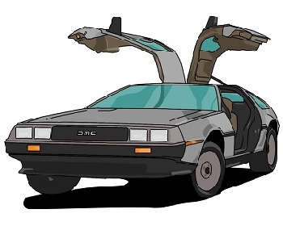

## DeLorean - The Time Machine for your Marty McFiles 

### Features coming
* Keep track of file changes
* Ability to quickly go back to any indexed version
* Keep it Simple

### Terminology
Keeping true to the theme of Science Fiction, Time travel, Cars and Science in general these are
some of the terminology you need to know relating it to terms used in Git and other Version Control systems.

* git init     -> delorean ride
* git add      -> delorean stage
* git commit   -> delorean pitstop
* git branch   -> delorean create-timeline
* git merge    -> delorean unify
* git checkout -> delorean goto
* git log      -> delorean show-timeline

### Getting Started Guide
To get started with using Delorean, you first need to build the project first.
To build it you need to have `gradle` installed on your machine, and then you can just do `gradle build` to build the project and generate the jar file (in `build/libs`).

If you don't have gradle installed or don't want to install it, it is fine. You can use the gradle wrapper provided in the project to build it. To use the wrapper to build, 
do `./gradlew build`. 

Whichever way you choose to build, you will see "Delorean-X.X.jar" in the `build/libs` directory. As part of the build, another task called "installDist" is also run. This will create
the `build/install` directory and everything in it. In `build/install/Delorean/bin`, you should see two executable script files (sh and bat files). With that, you should be able to run
the application. 

If you are on Linux or using Cygwin on Windows, I recommend creating an alias like this 

`alias delorean=$DELOREAN_HOME/build/install/Delorean/bin/Delorean`. 

Do something similar if you are
running the .bat file. With that you should be able to run and try out some of the commands mentioned above.

You can also use the script files in the `scripts` directory which use the fat jar that is generated
from the gradle task `fatJar`. 

### License

MIT LICENSE.

In short, you can do whatever you want with this project as long as you include the original copyright and license notice in any copies of the software.

For more information, refer to the LICENSE file.

### Commands that can be tried/used right now
(`delorean` will also be accessible as `de` in future)
* delorean ride
* delorean stage \<file(s)\>
* delorean unstage \<file(s)\>
* delorean pitstop -rl "rider log"
* delorean status
* delorean config config-name config-value
* delorean show-timeline
* delorean show-timeline --long
* delorean create-timeline
* delorean goto \<timeline or pitstop\>
* delorean describe \<pitstop(s)\>

